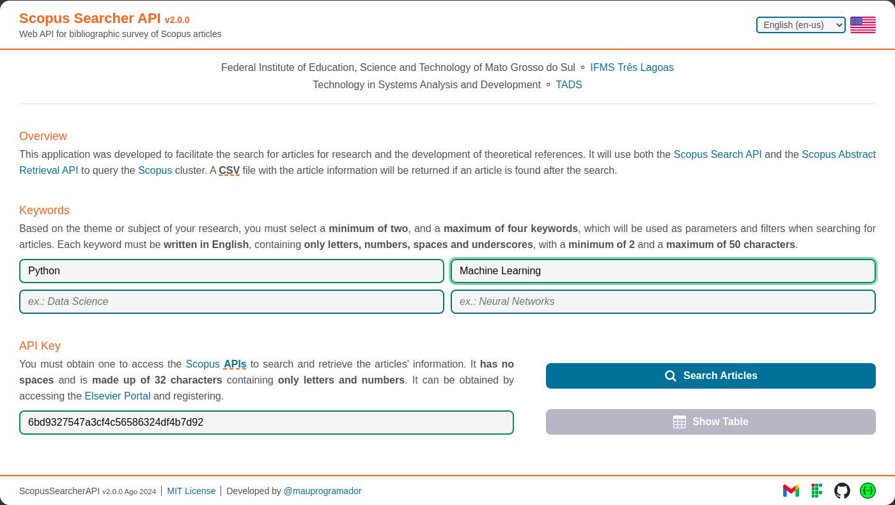

# Getting Started

## Clone

First you need to clone the project source code from the [GitHub](https://github.com/){:target="\_blank"} repository: <br>
:material-github: <{{links.repository}}>{:target="\_blank"}
<br><br>

On the [Bash](https://www.gnu.org/software/bash/manual/){:target="\_blank"} terminal using [Git](https://git-scm.com/){:target="\_blank"}:

```zsh
git clone {{links.repository}}.git
```

<br>
On [VsCode](https://code.visualstudio.com/){:target="\_blank"} using [Git Extension](https://git-scm.com/book/en/v2/Appendix-A%3A-Git-in-Other-Environments-Git-in-Visual-Studio-Code){:target="\_blank"}:

- Open the **Command Palette** and press `Ctrl` + `Shift` + `P` or `F1`.
- Select the `Git: Clone` command and click on it.
- Paste the repository {{abbr.url}}:

    ```url
    {{links.repository}}.git
    ```

- Press `Enter` or click on `Clone from URL` and select a directory.

!!! tip

    Take a look at [Git Source Control Documentation in **VsCode**](https://code.visualstudio.com/docs/sourcecontrol/overview){:target="\_blank"}.

## Run

=== "Poetry"

    ```zsh
    # Setup Venv
    make setup

    # Activate Venv
    source .venv/bin/activate

    # Install dependencies
    (.venv) make install

    # Run the App locally
    (.venv) make run
    ```

=== "Pip"

    ```zsh
    # Setup Venv
    make setup

    # Activate Venv
    source .venv/bin/activate

    # Install dependencies
    (.venv) pip3 install -r requirements/requirements.txt

    # Run the App locally
    (.venv) make run
    ```

=== "Docker"

    ```zsh
    # Run the App in Docker Container
    make docker
    ```

## Web Application

Once you start the application you can access the [Application Web Page](https://en.wikipedia.org/wiki/Web_application){:target="\_blank"} at: <br>
:octicons-browser-16: <http://127.0.0.1:8000/scopus-searcher/api>{:target="\_blank"}


!!! tip

    Select your preferred language by clicking the button next to the flag in the top right corner. Currently supported are English (`en-us`) and Portuguese (`pt-br`).

On the web page, click on the fields and enter your data, **making sure they are correct**:

- Enter your `API Key` and `Keywords` in the respective fields.
- Enter one `Keyword` for each field.
- It is required to fill in the `API Key` field and at least two `Keywords` fields.
- Click on the **Search Articles** button and wait for the search results.



All fields on the web page are configured to **verify** that the **information** in **each respective field** is correct, so you must be aware of the **rules and conditions** regarding the `API Key` and the `Keywords` provided in the [requirements section](./requirements.md).

As soon as you start typing in a field, it will automatically give you feedback, so stay tuned:

- Remember that it is required to fill in the `API Key` field and at least two `Keywords` fields.
- The red color will circe the field and a message will be shown if the data is incorrect.
- The green color will circle the field if the data is correct.


If any article is successfully found, a message will return informing you of success and a {{abbr.csv}} file containing all the search information will be automatically downloaded.


If no article is found, a message will return informing what went wrong. You should first read and analyze the message and try to understand what caused the error before trying again.


You can also check the request response in the browser's [DevTools](https://developer.chrome.com/docs/devtools){:target="\_blank"} inspect.


## Table of Articles

After **successfully** completing the search processing, in addition to downloading the {{abbr.csv}} file, the **Show Table** button will also be released, and when you click on it you will be redirected to a new page in which a table will display a preview of all the article data found.


The table below exemplifies the results of a search. Using **Computer Vision**, **Scopus** and **Machine Learning** as `Keywords`, a total of **71** articles were found. There was no [loss due to similarity](./api-limit-and-fields-and-filter.md#filtering-results) and it took around **18704.65ms**.


!!! note

    [Click here](../assets/data/example.csv){:download="example.csv"} to download the {{abbr.csv}} file of the search example above.

## Interactive Swagger

Once you start the application you can access the [Swagger UI](https://github.com/swagger-api/swagger-ui){:target="\_blank"} at <http://127.0.0.1:8000>{:target="\_blank"}.


Select the {{abbr.endpoint}} `/search-articles` and click on the **Try it out** button.

- Enter your `API Key` and `Keywords`.
- The `Keywords` must be separated by a comma.
- It is mandatory to fill in the `API Key` field and at least two `Keywords`.
- The `X-Access-Token` header will be setted automatically, you **should not** change it.
- Click on the **Execute** button.


If any article is successfully found, a {{abbr.csv}} file containing all the search information will be returned. You can click on the **Download** button to download the file.


If no article is found, a message will return informing what went wrong. You should first read and analyze the message and try to understand what caused the error before trying again.


