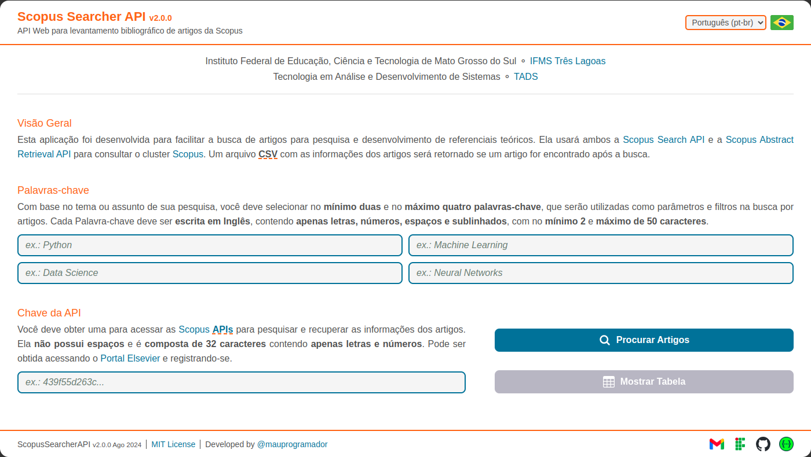
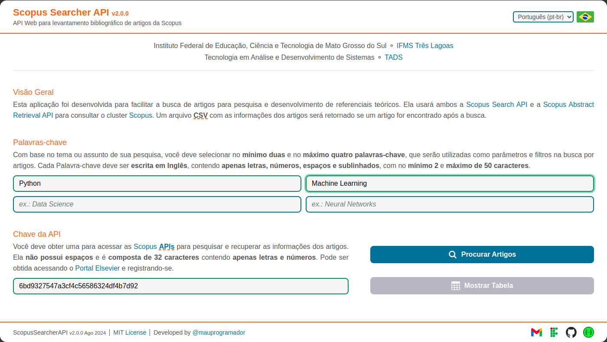
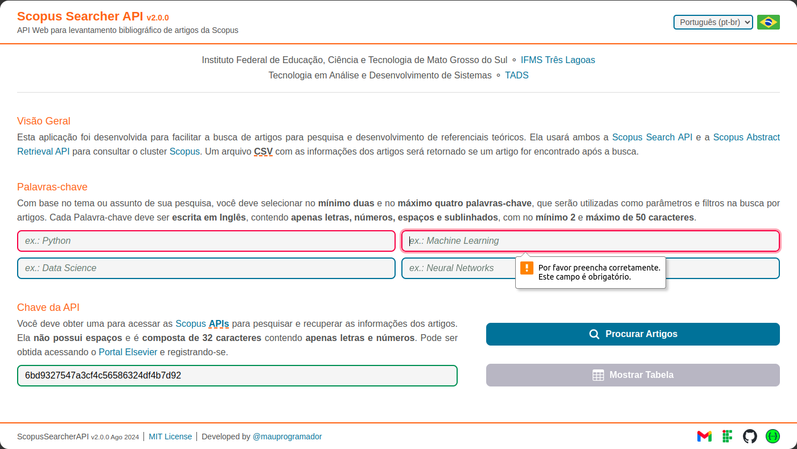
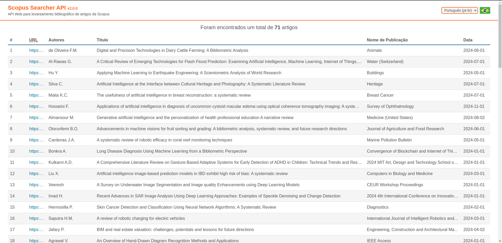
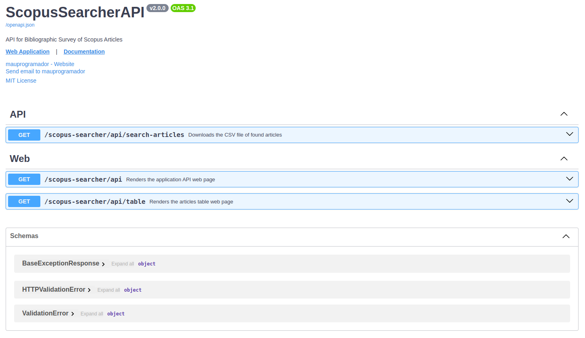
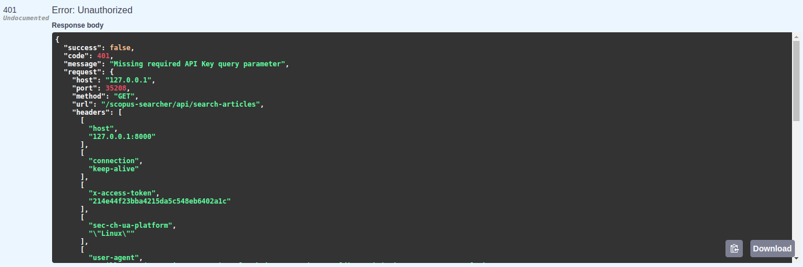

# Primeiros Passos

## Clone

Primeiro você precisará clonar o código-fonte do projeto do repositório no [GitHub](https://github.com/){:target="\_blank"}: <br>
:material-github: <{{links.repository}}>{:target="\_blank"}
<br><br>

No terminal [Bash](https://www.gnu.org/software/bash/manual/){:target="\_blank"} usando o [Git](https://git-scm.com/){:target="\_blank"}:

```zsh
git clone {{links.repository}}.git
```

<br>
No [VsCode](https://code.visualstudio.com/){:target="\_blank"} usando a [Extensão do Git](https://git-scm.com/book/en/v2/Appendix-A%3A-Git-in-Other-Environments-Git-in-Visual-Studio-Code){:target="\_blank"}:

- Abra a **Paleta de Comandos** e pressione `Ctrl` + `Shift` + `P` ou `F1`.
- Selecione o comando `Git: Clone` e clique nele.
- Cole a {{abbr.url}} do repositório:

  ```url
  {{links.repository}}.git
  ```

- Pressione `Enter` ou clique em `Clone from URL` e selecione um diretório.

!!! tip

    Dê uma olhada na [Documentação do Controle de Versão do Git no **VsCode**](https://code.visualstudio.com/docs/sourcecontrol/overview){:target="\_blank"}.

## Execute

=== "Poetry"

    ```zsh
    # Configure o Venv
    make setup

    # Ative o Venv
    source .venv/bin/activate

    # Instale as dependências
    (.venv) make install

    # Execute o App localmente
    (.venv) make run
    ```

=== "Pip"

    ```zsh
    # Configure o Venv
    make setup

    # Ative o Venv
    source .venv/bin/activate

    # Instale as dependências
    (.venv) pip3 install -r requirements/requirements.txt

    # Execute o App localmente
    (.venv) make run
    ```

=== "Docker"

    ```zsh
    # Execute o App em um Contêiner Docker
    make docker
    ```

---

## Aplicação Web

Depois de iniciar a aplicação, você pode acessar a [Página Web da Aplicação](https://en.wikipedia.org/wiki/Web_application){:target="\_blank"} em: <br>
:octicons-browser-16: <http://127.0.0.1:8000/scopus-survey/api>{:target="\_blank"}



!!! tip

    Selecione o idioma de sua preferência clicando no botão ao lado da bandeira no canto superior direito, Atualmente são suportados Inglês (`en-us`) e Português (`pt-br`).

Na página web, clique nos campos e insira seus dados, **certificando-se de que estão corretos**:

- Insira sua `Chave da API` e `Palavras-chave` nos respectivos campos.
- Insira uma `Palavra-chave` para cada campo..
- É obrigatório o preenchimento do campo da `Chave da API` e de pelo menos dois campos das `Palavras-chave`.
- Clique no botão **Procurar Artigos** e aguarde os resultados da busca.



Todos os campos da página web estão configurados para **verificar** se as **informações** de **cada respectivo campo** estão corretas, então você deve estar atento às **regras e condições** relativas à `Chave da API` e às `Palavras-chave` fornecidas na [seção de requisitos](./requirements.md).

Assim que você começar a digitar em um campo, ele lhe dará um feedback automaticamente, então fique atento:

- Lembre-se que é obrigatório o preenchimento do campo da `Chave da API` e de pelo menos dois campos das `Palavras-chave`.
- A cor vermelha circulará o campo e uma mensagem será mostrada caso os dados estejam incorretos.
- A cor verde circulará o campo se os dados estiverem corretos.



Se algum artigo for encontrado com sucesso, uma mensagem retornará informando sobre o sucesso e um arquivo {{abbr.csv}} contendo todas as informações da busca será baixado automaticamente.


Se nenhum artigo for encontrado, uma mensagem retornará informando o que houve de errado. Você deve primeiro ler e analisar a mensagem e tentar entender o que causou o erro antes de tentar novamente.


Você também pode verificar a resposta da requisição no inspecionar [DevTools](https://developer.chrome.com/docs/devtools){:target="\_blank"} do navegador.


## Tabela dos Artigos

Após concluir **com sucesso** o processamento da busca, além de baixar o arquivo {{abbr.csv}}, o botão **Mostrar Tabela** também será liberado, e ao clicar nele você será redirecionado para uma nova página na qual uma tabela exibirá uma prévia de todos os dados dos artigos encontrados.


A tabela abaixo exemplifica os resultados de uma busca. Usando **Computer Vision**, **Scopus** e **Machine Learning** como `Palavras-chave`, um total de **71** artigos foram encontrados. Não houve [perda por similaridade](./api-limit-and-fields-and-filter.md#filtrando-resultados) e levou cerca de **18704.65ms**.



!!! note

    [Clique aqui](../assets/data/example.csv){:download="example.csv"} para baixar o arquivo {{abbr.csv}} do exemplo da busca acima.

## Swagger interativo

Depois de iniciar a aplicação, você pode acessar o [Swagger UI](https://github.com/swagger-api/swagger-ui){:target="\_blank"} clicando em <http://127.0.0.1:8000>{:target="\_blank"}.



Selecione o {{abbr.endpoint}} `/search-articles` e clique no botão **Try it out**.

- Insira sua `Chave da API` e `Palavras-chave`.
- As `Palavras-chave` devem ser separadas por vírgula.
- É obrigatório o preenchimento do campo da `Chave da API` e de pelo menos duas `Palavras-chave`.
- O cabeçalho `X-Access-Token` será definido automaticamente, você **não deve** alterá-lo.
- Clique no botão **Execute**.


Se algum artigo for encontrado com sucesso, um arquivo {{abbr.csv}} contendo todas as informações da busca será retornado. Você pode clicar no botão **Download** para baixar o arquivo.


Se nenhum artigo for encontrado, uma mensagem será retornada informando o que houve de errado. Você deve primeiro ler e analisar a mensagem e tentar entender o que causou o erro antes de tentar novamente.


